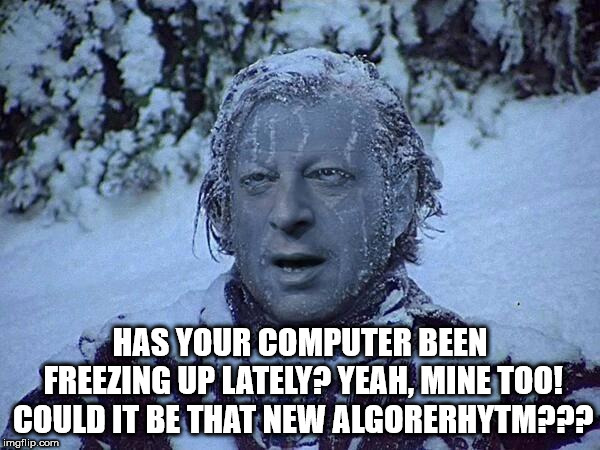

# Al ' Gore ' Rithms

Just Solving Algorthims For fun - From Basic to Advanced!




<hr>

### Convert From Celcius to Fahrenheit

The algorithm to convert from Celsius to Fahrenheit is the temperature in Celsius times 9/5, plus 32.

```js
function convertToF(celsius) {
  return celsius * 9/5 + 32;
}
```


<hr>

### Reverse A String 

Reverse the provided string.

You may need to turn the string into an array before you can reverse it.

Your result must be a string.

```js
function reverseString(str) {
  return str.split("").reverse().join("");
}
```


<hr>

### Factorialize A Number

Return the factorial of the provided integer.

If the integer is represented with the letter n, a factorial is the product of all positive integers less than or equal to n.

Factorials are often represented with the shorthand notation n!

```js
function factorialize(num) {
  if(num === 0) return 1
  return num * factorialize(num - 1);
}
```


<hr>

### Find The Longest Word In A String

Return the length of the longest word in the provided sentence.

Your response should be a number.

```js

function findLongestWordLength(str) {
  return str.split(" ").sort((a, b) => (
    b.length - a.length)
    )[0].length
}
```

<hr>

### Return Largest Numbers in Arrays

Return an array consisting of the largest number from each provided sub-array. 
For simplicity, the provided array will contain exactly 4 sub-arrays.


```js
function largestOfFour(arr) {
  return arr.map(elem => Math.max(...elem));
}
```

### Confirm The Ending

Check if a string (first argument, str) ends with the given target string (second argument, target).

```js

// This could have also been solved with .endswith() as well

function confirmEnding(str, target) {
  return str.split("").join("")
  .substr(str.length - target.length) === target
}
```